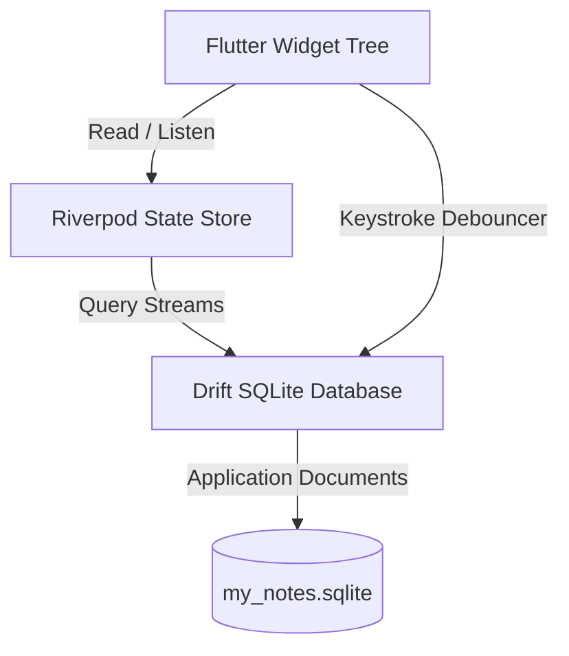

# 🌌 Aether Note

[](https://flutter.dev)
[](https://dart.dev)
[](https://opensource.org/licenses/MIT)
[](https://drift.simonbinder.eu/)
[](https://riverpod.dev)

A premium, **local-first**, markdown-powered cross-platform notes application designed for fluid, friction-free writing. Beautiful pastel themes, instant dynamic searches, and tag collections combine to elevate your personal knowledge base.

---

## ✨ Features

- **⚡ Debounced Background Auto-Save**: Write freely. Your notes are saved automatically 800ms after you stop typing—complete with real-time save state indicators in the top bar.
- **🎨 Premium Pastel Palettes**: Customize the visual mood of each note card using beautiful, curated pastel color bubbles tailored for both dark and light modes.
- **📝 Markdown Support**: A premium dual-pane writing experience. Edit code, then toggle directly into rich Markdown rendering featuring headers, tables, links, bold accents, and lists.
- **📌 Tag & Pin Organization**: Pin crucial items to the top of your dashboard. Categorize entries on the fly with dynamic inline tag chips that automatically populate the reactive sidebar.
- **🔍 Real-Time Full-Text Search**: Instantly find notes by matching title headers, content bodies, or tag keywords as you type.
- **🖥️ Responsive Split View**: Adaptive layouts optimized for desktop viewports (3-column master-detail sidebar layout) and mobile interfaces.

---

## 🛠️ Architecture & Tech Stack

Aether Note is engineered around local reliability and reactive programming patterns:



*   **UI/Presentation**: Declarative layout using **Flutter** and **Material 3**. Includes custom premium typography using the Google Fonts **Outfit** design.
*   **State Injection**: **Riverpod (v3)** manages active search queries, theme state (Light/Dark toggles), tag filtering criteria, and the currently selected detail view item.
*   **Local Storage Engine**: **Drift** (formerly `moor`) compiles Dart classes into structured SQL queries, wrapping native **SQLite** database drivers. Fully offline and private by default.

---

## 🚀 Getting Started

Follow these instructions to run and compile Aether Note on your local system:

### 📋 Prerequisites

Ensure you have the Flutter SDK installed on your environment.

```bash
# Check your installation
flutter doctor
```

### 📦 Setup & Run

1.  **Clone the Repository**:
    ```bash
    git clone https://github.com/your-username/aether-note.git
    cd aether-note
    ```

2.  **Install Dependencies**:
    ```bash
    flutter pub get
    ```

3.  **Run Code Generation**:
    Drift uses compiler-level code generators to establish type-safe SQLite database mappings. Run `build_runner` to build these schema files:
    ```bash
    flutter pub run build_runner build --delete-conflicting-outputs
    ```

4.  **Launch the Application**:
    ```bash
    # Run in Debug mode on your connected OS (Windows / macOS / Chrome / Mobile)
    flutter run
    ```

---

## 🛡️ License

This project is licensed under the MIT License - see the [LICENSE](LICENSE) file for details.
